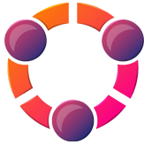

  
# Angelchain.io  
Angellchain.io is the official website of angel information, which is called Angel Chain. It formally develops the source code of the website from April 2019. It ends in May. The purpose of the official website is to shape the image of Angel Chain, transfer team information, program development progress and so on. It aims to face the supervision of the market and investors openly and fairly, and also to enable Angel Chain to win its place in the field of innovation.
## What's AngelChain？  
Angel Chain is an application technology based on providing cloud data computing services, large data storage services, data center analysis and intelligent AI judgment for docking terminals.  

By using the central points of grid computing, parallel computing and distributed computing, a large number of information resources and computing results are managed and analyzed through the network.  

The software and hardware developed by AngelChain can provide users with a variety of services.  

It can realize the functions of data storage, data calculation, server and application software.  

lock Chain Scenario Application for Hardware Device Resource Virtualization.  
## Angel Chain Application Scenario  
Charitable organizations have always played an important role in society, but when the lack of trust and false public and private interests spread slowly in the social environment, love and help, rescue, and social conscience all seem so insignificant.  

Angelchain has long insisted on philanthropy and increased his determination to develop public welfare. Through AI analysis of block chain data and cloud computing, Angelchain has become a three-dimensional central computing, and AI-ServerCloud computingAcSoftware has become a complete set of operating processes.  

Through the development team of China, Angel cloud computing Dispaly is built for the Chinese market environment, including location center, cloud computing center, data analysis center, user registration, rescue center, etc. Better data cooperation means more accurate judgment of the events to be faced.  

There is no need to worry about the security and integrity of data sharing in block chain networks. Angelchain provides an anonymous database and emergency database technology to create a secure and universal data structure.  
## Contributors  
Establishing a community of users and contributors so that the code does not have to rely on specific thinking cycles helps more people love the block chain, get more inspiration from it, and also live with generous reward  
##Contact us  
service@angelchain.io  
